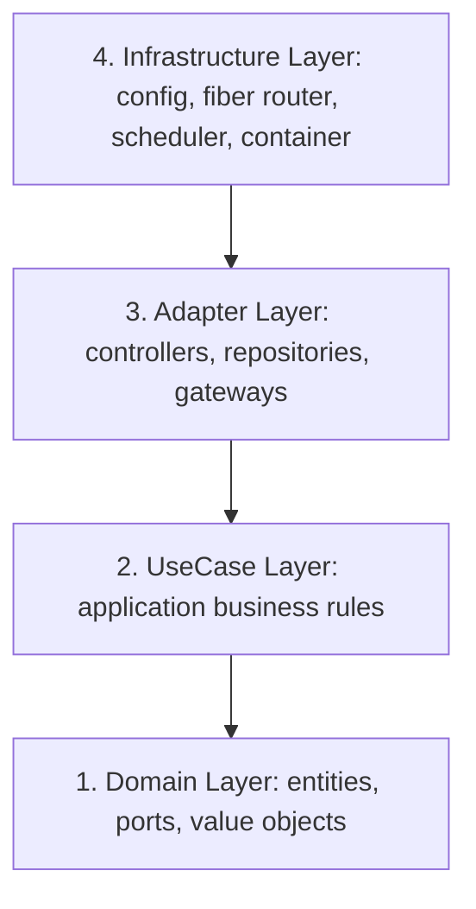

# Go Backend Development Rules & Guidelines

This document establishes the official design patterns, architectural boundaries, performance optimization practices, and testing rules for the HaberBot Go backend. All backend changes must strictly adhere to these guidelines.

---

## 1. Architectural Boundaries (Clean Architecture)
The project strictly implements **Clean Architecture** (Hexagonal/Onion Architecture) to achieve high testability, maintainability, and independence from external libraries or frameworks.



### Architectural Layer Rules:
1. **Domain Layer (`internal/domain/`)**:
   * Contains core business models (`entity/`) and domain types (`valueobject/`).
   * Defines all outbound adapters contracts (`port/`) as Go interfaces (e.g., `ArticleRepository`, `AIProcessor`).
   * **Rule:** Must not import any package outside of the domain layer. ZERO external framework dependencies.
2. **UseCase Layer (`internal/usecase/`)**:
   * Orchestrates the flow of data to and from domain entities to implement specific features.
   * Depend strictly on domain ports, never on concrete repository or gateway implementations.
   * **Rule:** Must be testable in isolation using mock implementations of the domain ports.
3. **Adapter Layer (`internal/adapter/`)**:
   * Implements the domain ports for database engines (`repository/`), third-party AI APIs (`gateway/`), and external feed fetchers (`fetcher/`).
   * Contains controllers or handlers (`handler/`) that receive HTTP requests and map them to UseCase calls.
4. **Infrastructure Layer (`internal/infrastructure/`)**:
   * Handles system-level configurations, HTTP router initialization (Fiber), cron schedules, and dependency injection container (`container/`).

---

## 2. API Integration & Resiliency Guidelines

Third-party APIs (such as Google Gemini) are prone to rate limits, quota limits, or transient network failures. The backend must be resilient to these issues.

### Rate-Limiting Rules:
* **Uniform Delay:** When calling rate-limited APIs in a loop, always execute a delay (e.g., `time.Sleep`) on **both success and failure paths** (using `continue`). Failing to sleep on errors results in cascading `429 Too Many Requests` errors.
* **Graceful Fallbacks:** Do not fail or crash the pipeline when an AI operation fails due to quota or parsing issues. Use elegant B-plan fallbacks:
  * If the AI fails to generate a summary field, assign a user-friendly default string (e.g., `"İçerik yetersiz olduğu için detaylı özet üretilemedi."`) rather than failing the transaction.
  * Allow unprocessed articles to be saved and visible to visitors. The database querying layer should not hide unprocessed items from public viewing if the UI provides elegant default fallback fields.
* **Prompt Safety:** When writing prompt templates for LLMs, always explicitly state rules for edge cases (e.g., what the model should output if the input content is extremely short or identical to the title).

---

## 3. Database & Performance Best Practices

Database adapter queries (`internal/adapter/repository/`) must be highly optimized for execution speed and resource management.

### PostgreSQL Connection Pooling:
* Database operations must use `pgxpool.Pool` to reuse open connections.
* **Pool Tuning Limits:** Keep limits tightly configured based on active traffic (e.g., `MaxConns = 25`, `MinConns = 5`, idle timeouts = 10m).

### Query Guidelines:
* **Connection Leaks:** Every `pool.Query(ctx, ...)` invocation must immediately defer `rows.Close()` to prevent connection leaks in PostgreSQL.
* **Named Fields:** Avoid `SELECT *`. Always explicitly list table column names in the SELECT clause to guarantee schema safety and optimize deserialization performance.
* **Index Coverage:** Queries that filter or sort by fields (e.g. `topic_id`, `created_at`, `fetched_at`) must be backed by appropriate compound or single indexes defined in the SQL migration files.

---

## 4. Testing & Test-Driven Development (TDD)

Code correctness and regressions must be prevented through standard unit tests.

### Test Rules:
* **Table-Driven Tests:** All critical utilities, data parsing functions, and validation logic must have table-driven unit tests (using the `testing` standard library).
* **Isolation:** Repository adapters and gate adapters must be testable through mock interface structures. Avoid making actual external network calls inside unit tests.
* **Coverage:** Run tests regularly during development using:
  ```bash
  go test -v ./...
  ```
