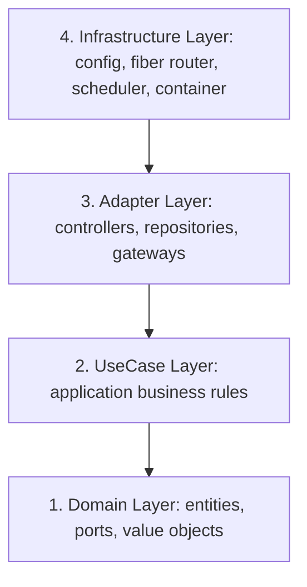

# ⚓ HaberBot Backend Kaptan Köşkü (backend.md)

Bu dosya HaberBot Go backend geliştirme süreçlerinin ana kumanda merkezidir. Antigravity backend ile ilgili bir dosya okuduğunda veya değiştireceğinde **her zaman ilk olarak bu kural dosyasını** referans alır. 

Geliştirme yaparken, üzerinde çalıştığınız konuya ait en detaylı kurallara ve kopyalanabilir şablonlara ulaşmak için aşağıdaki yönlendirme matrisini (routing) kullanmalı ve ilgili alt kural dosyasını belleğinize yüklemelisiniz.

---

## 🧭 1. Alt Kural Yönlendirme Haritası (Routing Matrix)

Çalıştığınız Go paketi veya konuya göre aşağıdaki bağlantılara giderek o alana özel detaylı kuralları okuyun:

1. **Katman sınırları, UseCase statelessness veya domain ports interface tasarımı yaparken:**
   👉 [Clean Architecture & Katman Sınırları (backend/clean-architecture.md)](file:///c:/Users/Batuhan/Desktop/deneme%20projem/.agents/rules/backend/clean-architecture.md)
   
2. **`pgxpool` veritabanı sorguları yazarken, rows.Close() defer işlemlerinde veya veritabanı indekslerinde:**
   👉 [PostgreSQL & Veri Tabanı Kuralları (backend/db-postgres.md)](file:///c:/Users/Batuhan/Desktop/deneme%20projem/.agents/rules/backend/db-postgres.md)

3. **Mistral/OpenAI API çağrıları, rate-limiting hata yönetimleri veya Gemini API B-Planı yedek akışlarında:**
   👉 [Dış API & Yapay Zeka Entegrasyon Kuralları (backend/api-gateway.md)](file:///c:/Users/Batuhan/Desktop/deneme%20projem/.agents/rules/backend/api-gateway.md)

4. **Go `testing` birim testleri, table-driven unit testler veya el yazımı port mock'ları yazarken:**
   👉 [TDD & Birim Test Kuralları (backend/testing-tdd.md)](file:///c:/Users/Batuhan/Desktop/deneme%20projem/.agents/rules/backend/testing-tdd.md)

5. **Goroutine yaşam döngüsü, channels, race condition önleme veya background scheduler iş akışlarında:**
   👉 [Eşzamanlılık & Performans Kuralları (backend/concurrency-performance.md)](file:///c:/Users/Batuhan/Desktop/deneme%20projem/.agents/rules/backend/concurrency-performance.md)

---

## 🏗️ 2. Clean Architecture Genel Katman Sınırları

HaberBot backend katmanı, dış altyapı bağımsızlığını ve yüksek test edilebilirliği korumak adına **Clean Architecture (Ports & Adapters)** prensiplerini tavizsiz uygular.

### 🔴 Somut Sınıf İthalat Yasağı (Concrete Import Restriction):
* **Kural:** UseCase yapıları (`internal/usecase/`) ve Handler/Controller yapıları (`internal/adapter/handler/`) asla veritabanı veya harici API'lerin somut (concrete) adapter sınıflarını (örneğin `PostgresArticleRepo` veya `OpenAIProcessor` yapılarını) **doğrudan ithal edemez ve kullanamaz**.
* **Arayüz Bağımlılığı:** Tüm iş mantığı, altyapı katmanlarına sadece `internal/domain/port/` altındaki **arayüzler (interfaces)** üzerinden bağımlı olmalıdır (Dependency Inversion).

---

## 🧱 3. Dependency Injection (DI) Sınırları

Projedeki tüm bağımlılıkların birbirine bağlanması (wiring) tek bir merkezden yönetilir.

* **Kural:** `internal/infrastructure/container/container.go` dosyası projenin Dependency Injection fabrikasıdır.
* **Maksimum İzolasyon:** Bu dosyanın içinde **asla iş mantığı (business logic), HTTP rota tanımları, ham SQL sorguları veya veritabanı yazma/okuma işlemleri yer alamaz**. Sadece somut sınıflar oluşturulup arayüzlere enjekte edilmelidir.

---

## 🧪 4. Sıfır Panic Standardı

Üretim ortamındaki backend kararlılığını korumak için:
* Ağ istekleri veya veri tabanı hatalarında **asla `panic()` çağrısı kullanılmamalıdır**.
* Tüm hatalar düzgün bir şekilde üst katmanlara `error` tipiyle iletilmeli ve en üst handler seviyesinde uygun HTTP hata kodlarıyla (Fiber) loglanarak istemciye dönülmelidir.
