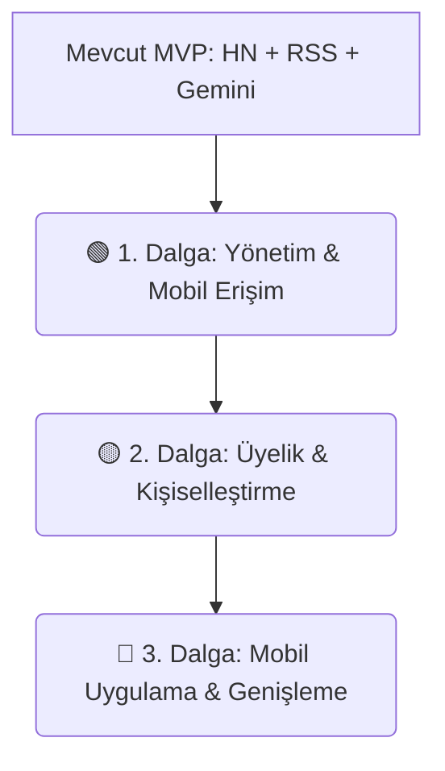

# HaberBot — Stratejik Ürün Yol Haritası (Product Roadmap)

Bu belge, HaberBot platformunun MVP (Minimum Viable Product) sonrasındaki stratejik gelişimini, önceliklerini ve sürüm planlamasını detaylandırmaktadır.

---

## 🧭 Genel Strateji ve Çıktı Hedefleri

HaberBot, teknoloji meraklılarının küresel teknolojik gelişmeleri Türkçe olarak en hızlı ve sade şekilde ("hap bilgi") takip etmesini hedefleyen yapay zeka destekli bir kürasyon platformudur. Yol haritamız, **ürün çıktısı (outcome-driven)** odaklı tasarlanmıştır.

---

## 🟢 1. DALGA: ŞİMDİ (Now - Yakın Dönem)
*Odak Noktası: Platform yönetilebilirliği, Türkçe arama deneyimi ve sıfır bütçeli mobil entegrasyon.*

### 🛠️ Epic 1: Görsel Yönetim Paneli (Admin UI)
*   **Hipotez**: Yönetici işlemlerinin (yeni konu ekleme, RSS akışı kaydetme, tetikleyiciler) arayüz üzerinden görselleştirilmesi, operasyonel hızı artıracak ve CLI/terminal bağımlılığını sonlandıracaktır.
*   **Kriterler**: 
    *   `/admin` rotası altında şifre korumalı bir arayüz.
    *   Konular (Topics) üzerinde CRUD (Ekleme/Düzenleme/Silme) ekranı.
    *   "Haber Çek" ve "AI Özetle" işlemlerini tek tıkla başlatan butonlar ve görsel durum barları.
*   **T-Shirt Boyutu**: Orta (M)

### 🔍 Epic 2: Arama ve Gelişmiş Filtreleme
*   **Hipotez**: Kullanıcıların haberler içinde Türkçe arama yapabilmesi ve veri kaynağına göre filtreleme yapması, site içi etkileşimi ve aranan bilgiye ulaşma hızını artıracaktır.
*   **Kriterler**:
    *   Ana sayfada anlık çalışan Türkçe arama kutusu.
    *   HackerNews ve RSS kaynakları için filtreleme butonları.
*   **T-Shirt Boyutu**: Küçük (S)

### 📱 Epic 3: PWA & Mobil Arayüz Optimizasyonu
*   **Hipotez**: Sitenin Progressive Web App (PWA) haline getirilmesi, mobil tarayıcıda "Uygulamayı Yükle" seçeneği sunarak gerçek mobil uygulama öncesi sıfır maliyetle mükemmel bir mobil deneyim sağlayacaktır.
*   **Kriterler**:
    *   PWA manifest ve service worker entegrasyonu (çevrimdışı okuma desteği).
    *   Mobil cihazlarda dokunmatik (swipe) hareketleriyle kategoriler arası geçiş.
*   **T-Shirt Boyutu**: Küçük (S)

---

## 🟡 2. DALGA: SONRA (Next - Orta Dönem)
*Odak Noktası: Ziyaretçi bağlılığı (Retention), kişiselleştirme ve topluluk oluşturma.*

### 🔑 Epic 4: Üyelik Sistemi & Favoriler (Auth & Bookmarks)
*   **Hipotez**: Kullanıcıların kayıt olarak beğendikleri haberleri kaydetmelerine olanak tanımak, platformun geri gelen kullanıcı (returning visitors) oranını %30 artıracaktır.
*   **Kriterler**:
    *   Güvenli JWT / Supabase Auth tabanlı üye girişi ve kaydı.
    *   Her haber kartında "Favorilere Ekle" butonu ve kullanıcıya özel favori listesi sayfası.
*   **T-Shirt Boyutu**: Orta (M)

### ⚙️ Epic 5: Kişiselleştirilmiş Akış (Custom Feed)
*   **Hipotez**: Üyelerin sadece takip etmek istediği alt kategorileri ve anahtar kelimeleri seçebilmesi, ilgisiz içerik oranını düşürerek oturum sürelerini uzatacaktır.
*   **Kriterler**:
    *   Kullanıcı profili altında konu ve anahtar kelime seçim ekranı.
    *   Seçimlere göre dinamik filtrelenen "Sana Özel" ana sayfa akışı.
*   **T-Shirt Boyutu**: Orta (M)

### 📧 Epic 6: Otomatik Haftalık E-posta Bülteni
*   **Hipotez**: Haftanın en çok puan alan / en çok okunan haberlerini otomatik olarak HTML bülteniyle üyelere göndermek, aktif olmayan kullanıcıların siteye geri dönüş oranını artıracaktır.
*   **Kriterler**:
    *   Resend veya Mailchimp API entegrasyonu.
    *   Her pazar günü otomatik oluşturulan ve gönderilen yapay zeka özetli bülten şablonu.
*   **T-Shirt Boyutu**: Orta (M)

---

## 🔵 3. DALGA: DAHA SONRA (Later - Uzun Dönem)
*Odak Noktası: Platform genişlemesi ve yerel mobil ekosisteme geçiş.*

### 📱 Epic 7: Yerel Mobil Uygulama (React Native / Expo)
*   **Hipotez**: Uygulama mağazalarında (App Store, Play Store) yer almak ve kırılma anı teknoloji haberleri için anlık bildirimler (push notifications) göndermek, günlük aktif kullanıcı (DAU) sayısını katlayacaktır.
*   **Kriterler**:
    *   Mevcut Go backend API'lerimizi kullanan hafif bir mobil istemci.
    *   Push notification entegrasyonu.
*   **T-Shirt Boyutu**: Büyük (L)

### 🌐 Epic 8: Yeni Geliştirici Kaynaklarının Entegrasyonu
*   **Hipotez**: RSS ve HackerNews dışındaki yazılımcı platformlarının (Dev.to, GitHub Trending, Medium) taranması, platformun teknoloji vizyonunu genişletecektir.
*   **Kriterler**:
    *   Dev.to ve GitHub API'leri için yeni Fetcher adaptörleri.
*   **T-Shirt Boyutu**: Orta (M)
