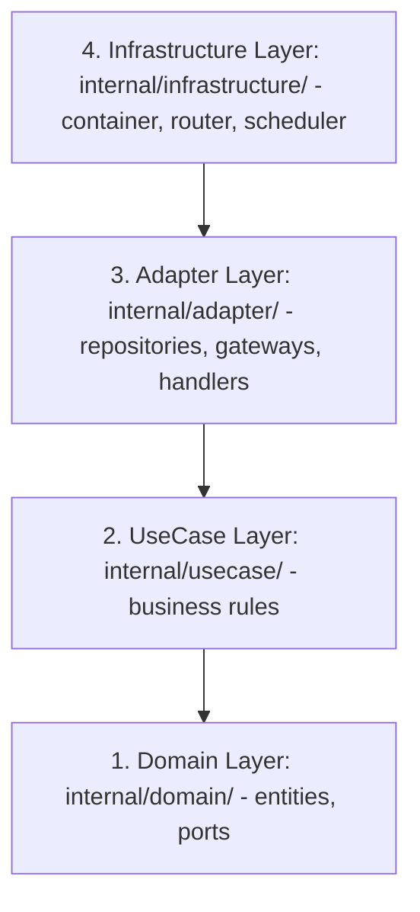

# Architecture

**Analysis Date:** 2026-05-27

## Pattern Overview

**Overall:** Decoupled client-server application consisting of a **Go Clean Architecture (Hexagonal/Ports & Adapters) Backend** and a **React 19 Single Page Application (SPA) Frontend**.

**Key Characteristics:**
- **Decoupled Architecture:** Strict separation between backend logic and database/external AI APIs using Ports (`internal/domain/port/`) as Go interfaces.
- **Presentation & Logic Separation:** Frontend components do not execute fetch operations directly; data fetching, caching, and state tracking are handled via custom hooks using TanStack React Query.
- **Stateless Backend:** Go UseCase layers (`internal/usecase/`) are completely stateless.
- **Resilient Fallback Design (B-Plan):** Frontend gracefully falls back to original titles or content previews if backend AI translation or summarization fails.

---

## Layers

### Backend Layers (Clean Architecture / Hexagonal)

1. **Domain Layer (`internal/domain/`):**
   * **Purpose:** Core business models and rules.
   * **Contains:** Entities (`entity/article.go`, `entity/topic.go`), ports (outbound/inbound interface declarations in `port/`).
   * **Dependencies:** Must not depend on any outer package. ZERO external frameworks.
   
2. **UseCase Layer (`internal/usecase/`):**
   * **Purpose:** Application-specific business rules orchestration.
   * **Contains:** UseCases coordinating data models (e.g. `article_usecase.go`).
   * **Dependencies:** Depends strictly on Domain interfaces (ports), never on concrete adapter structures.

3. **Adapter Layer (`internal/adapter/`):**
   * **Purpose:** Outer adapter implementation for databases, APIs, and Web.
   * **Contains:** `repository/` (SQL operations), `gateway/` (Gemini/OpenAI API integrations), `fetcher/` (RSS parsing), `handler/` (Fiber HTTP controllers).
   * **Dependencies:** Orchestrated by Usecases. Bridges internal models with external mechanisms.

4. **Infrastructure Layer (`internal/infrastructure/`):**
   * **Purpose:** System environment wiring, HTTP routing, scheduler triggers, dependency injection.
   * **Contains:** Dependency injection container (`container/container.go`), HTTP Router (Fiber server), and automated cron schedulers.

---

### Frontend Layers

1. **Routing and Page Layer (`src/pages/`, `src/App.jsx`):**
   * **Purpose:** Handle screen routing and render main application views.
   * **Contains:** Page shells such as `HomePage`, `ArticlePage`, `TopicPage`, `AdminPage`.

2. **Component Layer (`src/components/`):**
   * **Purpose:** Presentational React components.
   * **Contains:** Layout containers, visual news cards, loading skeletons, error/empty state fallbacks.

3. **Query/Service Layer (`src/hooks/`, `src/services/api.js`):**
   * **Purpose:** Remote data mutations, state caching, and API interactions.
   * **Contains:** Custom React Query custom hooks encapsulating the data lifecycle.

---

## Data Flow

### 1. automated Background News Pipeline (Cron Job)

1. `Infrastructure Scheduler` triggers cron job every X minutes.
2. `Fetcher Adapter` (`internal/adapter/fetcher/`) polls configured RSS endpoints.
3. Raw feeds parsed into domain entities (`entity/Article`).
4. Usecase orchestrates AI Processing:
   - Calls `go-readability` to parse clean body from article HTML.
   - Triggers `AIProcessor` gateway (`internal/adapter/gateway/gemini_processor.go`) to translate title and generate Turkish bullet-point summaries.
5. Translated and summarized article persisted via `ArticleRepository` in the database.

### 2. Client HTTP Request Lifecycle

1. User opens `HomePage` in their browser.
2. React component mounts, triggering TanStack React Query hook (e.g. `useArticles`).
3. Hook fires HTTP `GET` request to `/api/v1/articles` using `fetch` client in `src/services/api.js`.
4. Go Fiber router receives request and forwards to `ArticleHandler` (`internal/adapter/handler/article_handler.go`).
5. Handler maps query parameters to UseCase.
6. UseCase queries database via `ArticleRepository` adapter.
7. Postgres returns data, handler packages it as JSON.
8. React client caches the JSON payload, transitions component state from skeleton loader to active grid view.

---

## Key Abstractions

**Ports (Domain Interfaces):**
- **Purpose:** Decouple domain layer from infrastructural dependencies.
- **Examples:** `port.ArticleRepository`, `port.AIProcessor` in `internal/domain/port/`.
- **Pattern:** Interface segregation pattern.

**Dependency Injection Container:**
- **Purpose:** Wire components together during server bootstrap.
- **Location:** `internal/infrastructure/container/container.go`.
- **Pattern:** Registry / DI Factory pattern.

---

## Entry Points

**Go Backend Entry:**
- **Location:** `backend/cmd/server/main.go`
- **Triggers:** Running the Go server binary.
- **Responsibilities:** Load `.env`, build pgxpool connections, initialize DI Container, configure cron schedules, register Fiber routes, start listening on selected port.

**Vite-React Frontend Entry:**
- **Location:** `frontend/src/main.jsx`
- **Triggers:** Browser opening the application bundle.
- **Responsibilities:** Configure TanStack Query client wrapper, register client routers, inject global styling tokens (`index.css`), mount the main root component (`App.jsx`).

---

## Error Handling

**Backend Strategy:**
- Outbound adapters (gateways, database queries) return Go errors.
- Usecases wrap and bubble errors to the handler.
- Handler translates errors to semantic HTTP statuses (e.g., `404 Not Found`, `400 Bad Request`, `500 Internal Server Error`) and logs error detail.

**Frontend Strategy:**
- React Query handles query errors, transitioning state to `isError` flags.
- UI renders elegant fallback alerts, allowing users to retry fetching instead of freezing in blank views.

---

*Architecture analysis: 2026-05-27*
*Update when major patterns change*
