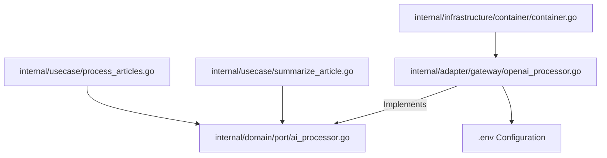

# Architectural Specification: Transition to Mistral AI (OpenAI-Compatible Client)

This document specifies the technical design for migrating HaberBot's AI-processing engine from Google Gemini to Mistral AI using an OpenAI-compatible Go client. 

## 1. Problem Statement & Motivation
 Hitherto, HaberBot leveraged Google Gemini API via the proprietary `generative-ai-go` SDK. However, rate limits and quota constraints in Google AI Studio have restricted processing throughput.
Mistral AI provides an extremely generous free tier of **1 billion tokens per month**, making it the ideal engine for translating large technical articles in the background, while maintaining highly competitive bilingual (English-to-Turkish) translation quality.

To maintain maximum flexibility and prevent vendor lock-in (aligned with `ADR-004`), we will not use Mistral's proprietary SDK. Instead, we will leverage Mistral's **OpenAI-compatible endpoints** using the industry-standard `go-openai` library. This allows us to swap providers (Mistral, Groq, Ollama) purely via configuration.

---

## 2. Structural & Architectural Overview

The backend conforms strictly to Clean Architecture (Ports & Adapters). Changing the AI provider is localized entirely to the **Infrastructure** and **Adapter** layers. The **Domain** and **UseCase** layers remain unchanged.



---

## 3. Detailed Specifications

### A. Environment Configuration (`.env`)
We will transition from Gemini-specific variables to generic AI configuration variables:

```env
# AI Provider Configuration (OpenAI-Compatible)
AI_API_KEY=your_mistral_api_key
AI_BASE_URL=https://api.mistral.ai/v1
AI_MODEL=mistral-large-latest
```
> [!NOTE]
> `mistral-large-latest` will be our default model for premium-grade translation and reasoning. We can also configure `open-mistral-nemo` or `codestral-latest` based on latency and specific token demands.

---

### B. Dependency Updates
We will add `github.com/sashabaranov/go-openai` to `go.mod` to handle standard HTTP payloads, timeouts, retries, and connection pooling.

---

### C. Port Interface (`internal/domain/port/ai_processor.go`)
The port contract remains unchanged, ensuring zero compilation impact on UseCases:
```go
package port

import "context"

type AIProcessor interface {
	Translate(ctx context.Context, title, content string) (turkishTitle string, turkishContent string, err error)
	Summarize(ctx context.Context, content string) (string, error)
}
```

---

### D. New Adapter Implementation (`internal/adapter/gateway/openai_processor.go`)
We will create a new adapter that implements `port.AIProcessor` using `go-openai`.

#### Model Prompts
The prompt templates will be ported directly to ensure technical jargon is preserved during translation, and concise "hap bilgi" is produced for summaries.

```go
const translatePromptTemplate = `Sen bir teknoloji haberleri çevirmenisin.
Görevin: Verilen İngilizce makale başlığını ve metnini profesyonel, akıcı bir Türkçeye çevirmek.
Kurallar:
- Teknik terimler İngilizce kalmalı (ör: API, machine learning, framework, React, Go)
- Emoji kullanma
- Doğal ve akıcı Türkçe yaz
- SADECE çeviriyi ver, kendi yorumunu katma.

Başlık: %s
İçerik: %s

Yanıtını tam olarak şu formatta ver:
BASLIK: [Türkçe başlık]
METIN: [Türkçe tam çeviri]`
```

```go
const summarizePromptTemplate = `Sen bir özetleyicisin.
Görevin: Verilen Türkçe makaleden 3-4 cümlelik "hap bilgi" özeti oluştur.
SADECE özeti ver.

İçerik: %s

Yanıtını tam olarak şu formatta ver:
OZET: [Özet metni]`
```

---

### E. Configuration & Dependency Injection (`internal/infrastructure/container/container.go`)
1. Update `config.go` to parse the new `AI_API_KEY`, `AI_BASE_URL`, and `AI_MODEL` env parameters.
2. Update `container.go` to instantiate `gateway.NewOpenAIProcessor(cfg.AIAPIKey, cfg.AIBaseURL, cfg.AIModel)` instead of `NewGeminiProcessor`.

---

## 4. Verification & Testing Plan

### A. Unit Testing
We will create `openai_processor_test.go` with table-driven tests verifying:
- Formatting and extraction logic for `BASLIK:` and `METIN:` from raw chat output.
- Formatting and extraction logic for `OZET:` summaries.
- Proper fallback behaviors if the model responds in non-standard layout.

### B. Integration Testing
A one-off scratch script `backend/test_openai.go` will be executed to send a real payload to Mistral's API endpoint, asserting that it returns a correct translation and summary.
