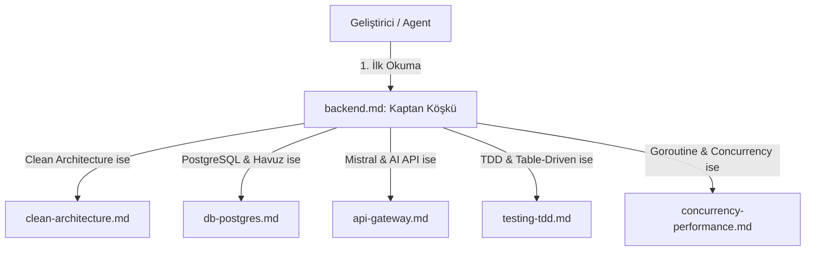

# HaberBot Backend Hiyerarşik Kural Sistemi Tasarım Spesifikasyonu

Bu spesifikasyon belgesi, HaberBot projesinin Go tabanlı Clean Architecture backend katmanında kod kalitesini, katman sınırlarını, veri tabanı performansını ve test güvenilirliğini korumak amacıyla kurulan modüler ve hiyerarşik kural sistemini tanımlar.

---

## 1. Mimari Genel Bakış

Projedeki kurallar, Antigravity sisteminin otomatik okuma yeteneğinden faydalanarak `.agents/rules/` klasörü altında yapılandırılacaktır. Bu sistem "Kaptan Köşkü" rolündeki tek bir ana dosya ve ona bağlı `backend/` alt klasörü içindeki 5 adet derinlemesine detaylandırılmış alt kural dosyasından oluşur.

---

## 2. Kural Dosyaları ve Eşleşen Dizin Kuralları

Her kural dosyası, Antigravity'ye hangi koşullar altında tetiklenmesi gerektiğini söyleyen glob desenleri ve referanslar içerecektir.

### 2.1. `backend.md` (Ana Yönlendirici / Kaptan Köşkü)
* **Konum:** `.agents/rules/backend.md`
* **Görevi:** Backend geliştirmelerine başlarken tüm süreci yönetir ve alt kural dosyalarına dallanmayı sağlar.
* **Tetikleyiciler:** `backend/**/*`, `*.go`
* **İçerik Başlıkları:**
  * Clean Architecture genel katman tanımları (Domain, UseCase, Adapter, Infrastructure).
  * Somut sınıf ithalat yasağı (Concrete Import Restriction).
  * Dependency Injection (`container.go`) kuralları.
  * Diğer 5 alt kural dosyasına yönlendirme (routing) matrisi.

### 2.2. `clean-architecture.md` (Clean Architecture & Katman Sınırları)
* **Konum:** `.agents/rules/backend/clean-architecture.md`
* **Görevi:** Domain arayüz bağımsızlığını ve UseCase katman sınırlarını korumak.
* **Referans Yetenekler:** `architecture-patterns`, `api-and-interface-design`
* **İçerik Başlıkları:**
  * Domain katmanında (`internal/domain/`) harici kütüphane ithalatı yasağı.
  * UseCase yapılarının durumsuz (stateless) tasarlanması kuralları.
  * Port ve adapter entegrasyon arayüz sözleşmeleri.

### 2.3. `db-postgres.md` (PostgreSQL, Havuz ve Sorgu Optimizasyonu)
* **Konum:** `.agents/rules/backend/db-postgres.md`
* **Görevi:** pgxpool bağlantı havuzu verimliliği ve sorgu performansı standartları.
* **Referans Yetenekler:** `neon-postgres`
* **İçerik Başlıkları:**
  * `pool.Query` veya `pool.QueryRow` sonrasında `rows.Close()` defer etme zorunluluğu (bağlantı sızıntısı engelleme).
  * `SELECT *` kullanımının kesin yasağı (Named Fields zorunluluğu).
  * Bileşik (compound) ve tekil (single) indeks kuralları ve migrasyon standartları.

### 2.4. `api-gateway.md` (Dış API ve Yapay Zeka Entegrasyon Güvenliği)
* **Konum:** `.agents/rules/backend/api-gateway.md`
* **Görevi:** Mistral/OpenAI API çağrıları, kota yönetimi ve rate-limiting dayanıklılığı.
* **İçerik Başlıkları:**
  * Hata ve başarı akışlarında Uniform Delay (`time.Sleep` 429 engelleme).
  * Gemini API çökmeleri veya kotaları için UseCase bazlı B-Planı varsayılan veri atama standartları.
  * Sistem prompt edge-cases yönetimi ve prompt enjeksiyon güvenliği.

### 2.5. `testing-tdd.md` (TDD, Birim Test ve Mocks)
* **Konum:** `.agents/rules/backend/testing-tdd.md`
* **Görevi:** Test-driven geliştirme kalitesi ve table-driven birim test standartları.
* **Referans Yetenekler:** `golang-pro`, `test-driven-development`
* **İçerik Başlıkları:**
  * Go standart `testing` paketi ile table-driven test şablonları.
  * Go standart kütüphanesini kullanarak el yazımı port mock struct şablonları.
  * UseCase katmanının veri tabanından tamamen bağımsız test edilme kuralları.

### 2.6. `concurrency-performance.md` (Eşzamanlılık, Goroutines ve Performans)
* **Konum:** `.agents/rules/backend/concurrency-performance.md`
* **Görevi:** Go eşzamanlılık modelleri (goroutines, channels) ve arka plan görev yönetimi.
* **Referans Yetenekler:** `golang-pro`, `performance-optimization`
* **İçerik Başlıkları:**
  * Goroutine sızıntılarını (leak) önlemek için Context iptali ve yaşam döngüsü kuralları.
  * Eşzamanlı erişimde race condition engelleme (`sync.Mutex` / Channels).
  * Background cron/scheduler (veri çekme hatları) performans kuralları.

---

## 3. Doğrulama ve Test Planı

Oluşturulan backend kural hiyerarşisinin Antigravity tarafından başarıyla algılanıp yorumlandığı şu adımlarla test edilecektir:
1. **Markdown Linter:** Dosyalarda geçersiz biçimlendirme ve kırık bağlantı (link) kontrolü yapılacaktır.
2. **Kaptan Köşkü Testi:** `backend.md` dosyasındaki göreceli yönlendirme linklerinin `backend/` klasöründeki dosyalara başarıyla yönlendiği teyit edilecektir.
3. **Uygulama Doğrulaması:** backend klasöründeki Go dosyalarında çalışırken kuralların otomatik referans alınabildiği doğrulanacaktır.
