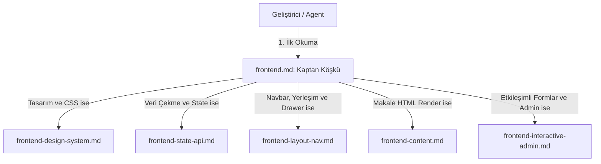

# HaberBot Frontend Hiyerarşik Kural Sistemi Tasarım Spesifikasyonu

Bu spesifikasyon belgesi, HaberBot projesinin React 19 / Vite tabanlı frontend katmanında kod kalitesini, Clean Architecture sınırlarını ve premium koyu tema estetiğini korumak amacıyla kurulan modüler ve hiyerarşik kural sistemini tanımlar.

---

## 1. Mimari Genel Bakış

Projedeki kurallar, Antigravity sisteminin otomatik okuma yeteneğinden faydalanarak `.agents/rules/` klasörü altında yapılandırılacaktır. Bu sistem "Kaptan Köşkü" rolündeki tek bir ana dosya ve ona bağlı 5 adet derinlemesine detaylandırılmış alt kural dosyasından oluşur.

---

## 2. Kural Dosyaları ve Eşleşen Dizin Kuralları

Her kural dosyası, Antigravity'ye hangi koşullar altında tetiklenmesi gerektiğini söyleyen glob desenleri ve referanslar içerecektir.

### 2.1. `frontend.md` (Ana Yönlendirici / Kaptan Köşkü)
* **Konum:** `.agents/rules/frontend.md`
* **Görevi:** Frontend geliştirmelerine başlarken tüm süreci yönetir ve alt kural dosyalarına dallanmayı sağlar.
* **Tetikleyiciler:** `frontend/**/*`, `*.jsx`, `*.css`
* **İçerik Başlıkları:**
  * React 19 temel ilkeleri (ternary kullanımı, `useTransition` önceliği).
  * Sunum ve Mantık (Logic & Presentation) ayrımı: HTTP/Fetch isteklerinin bileşenlerden custom hook'lara taşınması zorunluluğu.
  * Diğer 5 alt kural dosyasına yönlendirme (routing) matrisi.

### 2.2. `frontend-design-system.md` (Tasarım Sistemi ve Estetik)
* **Konum:** `.agents/rules/frontend-design-system.md`
* **Görevi:** Görsel kaliteyi, koyu tema tutarlılığını ve mikro-animasyon standartlarını en üst düzeye çıkarmak.
* **Referans Yetenek:** `frontend-design`
* **İçerik Başlıkları:**
  * Resmi renk paleti kodları: Pitch Black (`#000000`), Dark Gray (`#050505`), Brand Blue (`#2563eb`), Glow Accent (`#3b82f6`).
  * **Kırmızı Rengin Kesin Yasağı:** Proje tamamen mavi-siyah kimliğe sahiptir. Kırmızı tonlar (hata durumları hariç) arayüzde kullanılamaz.
  * **Glassmorphism CSS Şablonu:** backdrop-filter ve ince kenarlık kuralları.
  * **Mikro-Animasyon Standartları:** Hover ve active durumlarında kullanılacak CSS transform ve scale kodları.

### 2.3. `frontend-state-api.md` (Veri Çekme, State ve B-Planı)
* **Konum:** `.agents/rules/frontend-state-api.md`
* **Görevi:** TanStack React Query standartları ve Gemini API hatalarına karşı dayanıklılık (resilience).
* **Referans Yetenek:** `vercel-react-best-practices`
* **İçerik Başlıkları:**
  * TanStack React Query `useQuery` ve `useMutation` custom hook şablonları.
  * API Waterfall'ları önlemek için paralel fetch `Promise.all` şablonları.
  * **B-Planı Fallback Şablonları:** `title_tr` yoksa `title` render etme; `summary_tr` yoksa `original_content` preview gösterme kod blokları.

### 2.4. `frontend-layout-nav.md` (Navigasyon, Yerleşim ve Drawer Güvenliği)
* **Konum:** `.agents/rules/frontend-layout-nav.md`
* **Görevi:** Full-width akışkan navbar tasarımları ve fixed drawer katmanlanma (stacking context) hatalarının çözümü.
* **İçerik Başlıkları:**
  * Fluid Navbar CSS kuralları (Header genişliğinin 100% yayılması).
  * **Fixed Drawer Stacking Context Güvenliği:** `position: fixed` olan tüm yan menülerin ebeveyn transform/filter/backdrop-filter içeren div'lerin dışına yerleştirilmesi kuralları.

### 2.5. `frontend-content.md` (Zengin HTML İçerik ve Makale Görünümü)
* **Konum:** `.agents/rules/frontend-content.md`
* **Görevi:** RSS ham makale HTML verilerini kusursuz gazete/dergi estetiğiyle sunmak.
* **İçerik Başlıkları:**
  * `dangerouslySetInnerHTML` güvenli render kalıpları.
  * `.news-content` sınıfı altında yer alan `
`, `<h2>`, `blockquote`, `pre` etiketlerinin okuma dostu tipografi (line-height: 1.8) ve kenar boşluğu (margin) ayarları.

### 2.6. `frontend-interactive-admin.md` (Etkileşim, Formlar ve Admin)
* **Konum:** `.agents/rules/frontend-interactive-admin.md`
* **Görevi:** Form elemanları, login tasarımı, skeleton ekranlar ve admin yönetimi.
* **İçerik Başlıkları:**
  * Focus durumunda glow efekti alan koyu tema form girdi tasarımları.
  * Premium skeleton loader (pulse animasyonlu) şablonları.
  * Admin paneli RSS kaynağı ekleme/çıkarma formu etkileşim kuralları.

---

## 3. Doğrulama ve Test Planı

Oluşturulan kuralların Antigravity sistemi tarafından başarıyla okunduğu ve yorumlandığı aşağıdaki adımlarla test edilecektir:
1. **Linter Kontrolü:** Kural dosyalarında geçersiz Markdown veya kod biçimlendirmesi olmaması sağlanacaktır.
2. **Kaptan Köşkü Bağlantı Testi:** `frontend.md` dosyasındaki göreceli bağlantıların (links) geçerli dosyalara yönlendiği teyit edilecektir.
3. **Uygulama Doğrulaması:** Yeni kuralların proje kuralları arasına katılmasıyla Antigravity'nin sonraki frontend geliştirme süreçlerinde bu kuralları referans göstererek çalıştığı doğrulanacaktır.
